# Visual Reference — Plugin Rendering Guide

This document shows the expected visual output of each view tab in the plugin.
Use it as a reference when implementing or reviewing diagram rendering.

All screenshots were taken from the VS Code extension in official SysML v2
service mode (Architect role).

---

## Plugin layout

The plugin occupies the right half of the VS Code panel.  Three side-by-side
columns are always visible:

| Column | Contents |
|---|---|
| **SysML v2 Source** (left) | Monaco editor with the `.sysml` file |
| **Model Explorer** (centre) | Tree of parsed packages, part types, and system parts; STATE MACHINES section for `state def` containers |
| **Diagram area** (right) | Active view tab + canvas + Inspector panel |

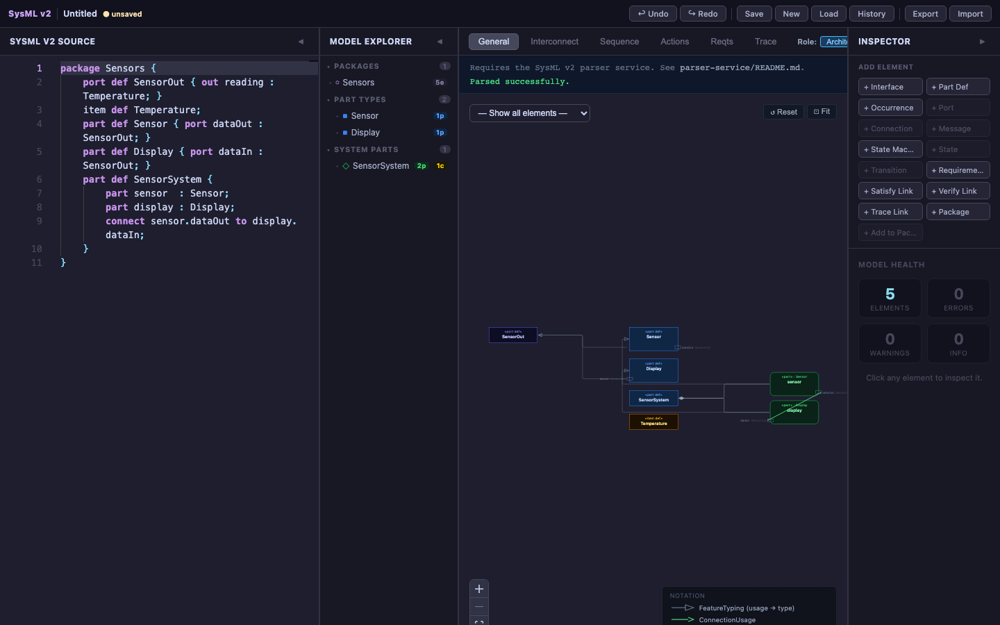

The tab bar above the canvas switches between **General**, **Interconnect**,
**Sequence**, **Actions**, **Reqts**, **Trace**, and **Role** views.  The
**Inspector** panel on the far right shows element details on click.

---

## General view

The General tab renders a class-diagram-style overview of all named element
definitions and the relationships between them.

### Full UI

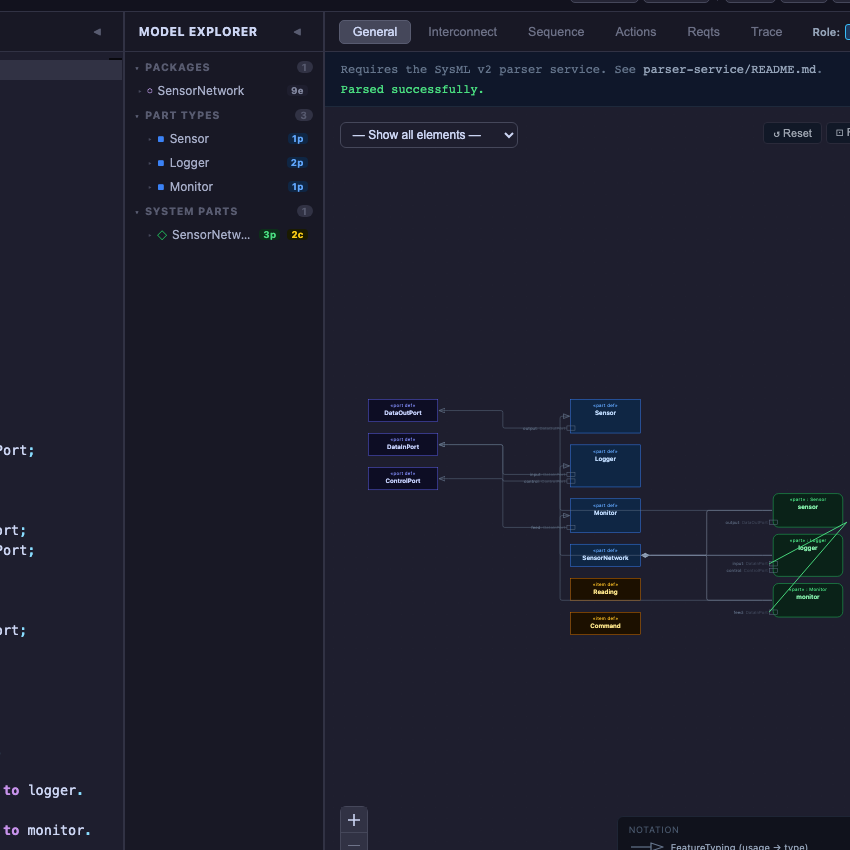

Notable UI elements:
- **— Show all elements —** dropdown at the top-left filters node types.
- **Reset** and **Fit** buttons pan/zoom the canvas back to fit all nodes.
- **NOTATION** legend in the bottom-right corner of the canvas explains each
  arrow type with a mini-sample.
- The Model Explorer shows **PACKAGES**, **PART TYPES** (with port counts in
  blue), and **SYSTEM PARTS** (assemblies in teal with part and connection
  counts).

### Diagram canvas

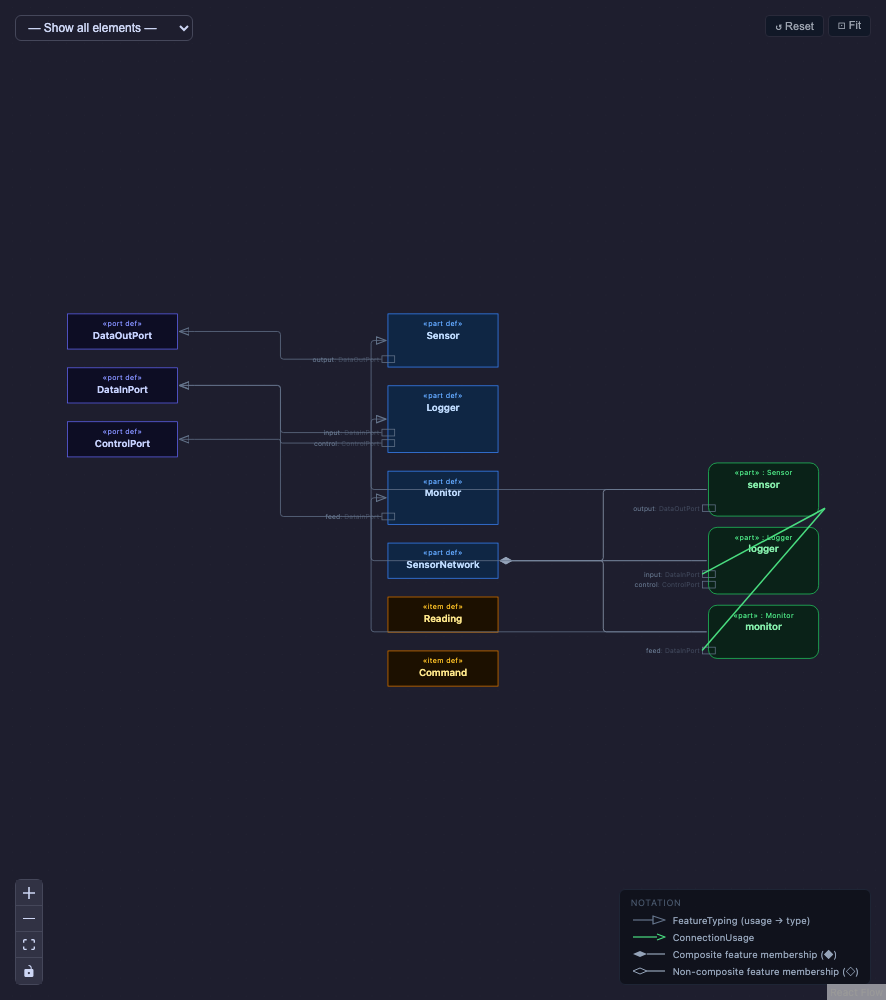

**Three-column layout:**

| Column | Node colour | Contents |
|---|---|---|
| Left | Indigo | `«port def»` nodes |
| Centre | Blue / Amber / Cyan / Lime | All definition types (`«part def»`, `«item def»`, `«attribute def»`, `«action def»`, …) |
| Right | Green / Amber | Part usages (`«part»`) and item usages (`«item»`) |

**Arrow types visible here:**
- Thin gray arrow with hollow triangle → `FeatureTyping` (usage `: TypeName`)
- Green arrow with open arrowhead → `ConnectionUsage` (`connect`)
- Gray filled-diamond line → composite feature membership (`part` inside a def)
- Gray open-diamond line → non-composite reference (`ref part`)

### Node colour reference

| Colour | Stereotype shown | Element type |
|---|---|---|
| Blue (dark) | `«part def»` | `PartDefinition`, `RequirementDefinition`, `UseCaseDefinition`, … |
| Indigo | `«port def»` | `PortDefinition` |
| Violet | `«interface def»` | `InterfaceDefinition`, `ConnectionDefinition` |
| Amber / gold | `«item def»` | `ItemDefinition` |
| Cyan | `«attribute def»` | `AttributeDefinition` |
| Lime-green | `«action def»` | `ActionDefinition`, `StateDefinition`, `BehaviorDefinition` |
| Green (bright) | `«part»` | `PartUsage` (right column) |
| Orange | `«scenario»` | `OccurrenceDefinition` with no body |

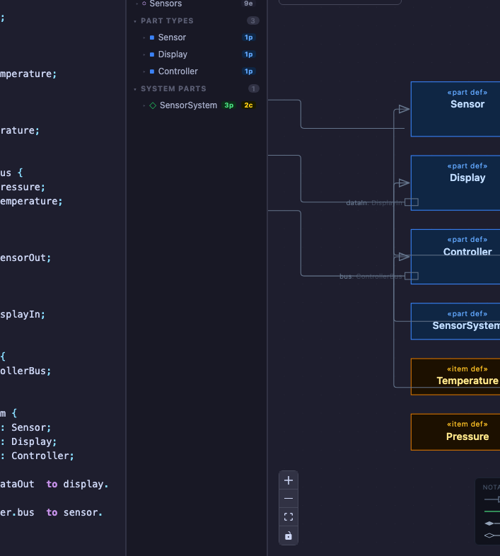

---

## Interconnect view

The Interconnect tab renders the internal wiring of a structural assembly:
part boxes, port squares, and the connections between them.

### Full UI

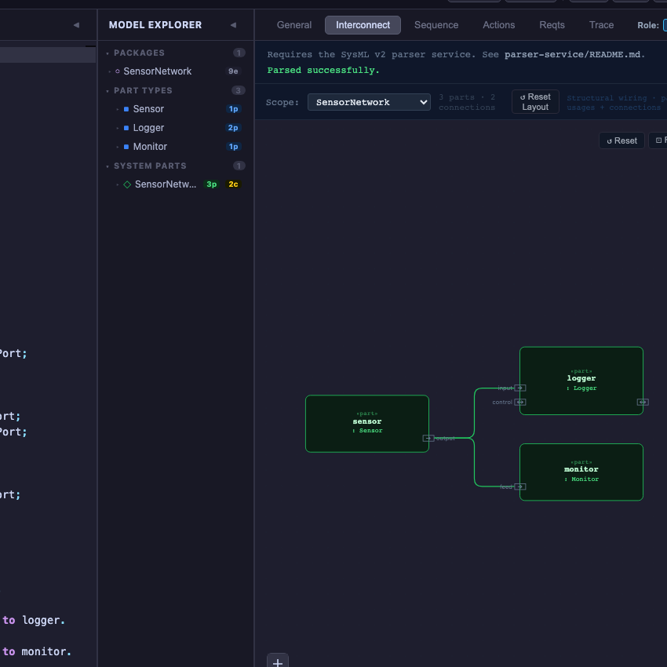

Notable UI elements:
- **Scope** dropdown selects which assembly to render.  Assemblies (with nested
  parts) appear first; leaf components appear in a second group.
- Summary line shows `N parts · M connections` for the selected scope.
- **Structural wiring** / **usages + connections** toggle switches between
  showing only structural connections or all usages.

### Diagram canvas

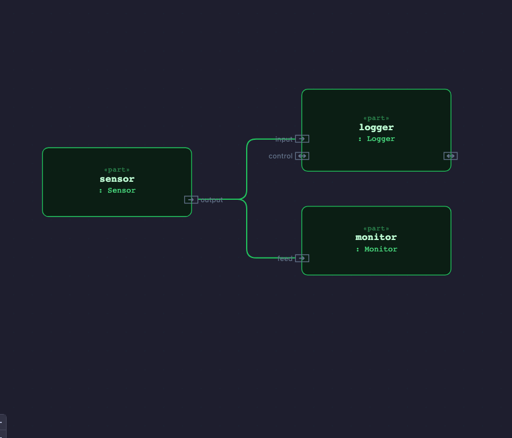

**Visual elements:**
- Each `part` usage is a dark-green rounded rectangle labelled
  `«part» name : TypeName`.
- Each `port` usage is a small square on the edge of the part box, labelled
  with the port name.  The symbol inside the square shows direction:
  - `→` out-only port
  - `←` in-only port
  - `↔` bidirectional port (both `in` and `out` features)
- A `connect` statement is a plain line between two port squares (no
  arrowhead, not animated).
- A `flow` statement is an animated dashed line with a filled arrowhead at the
  target end.

### Port squares close-up

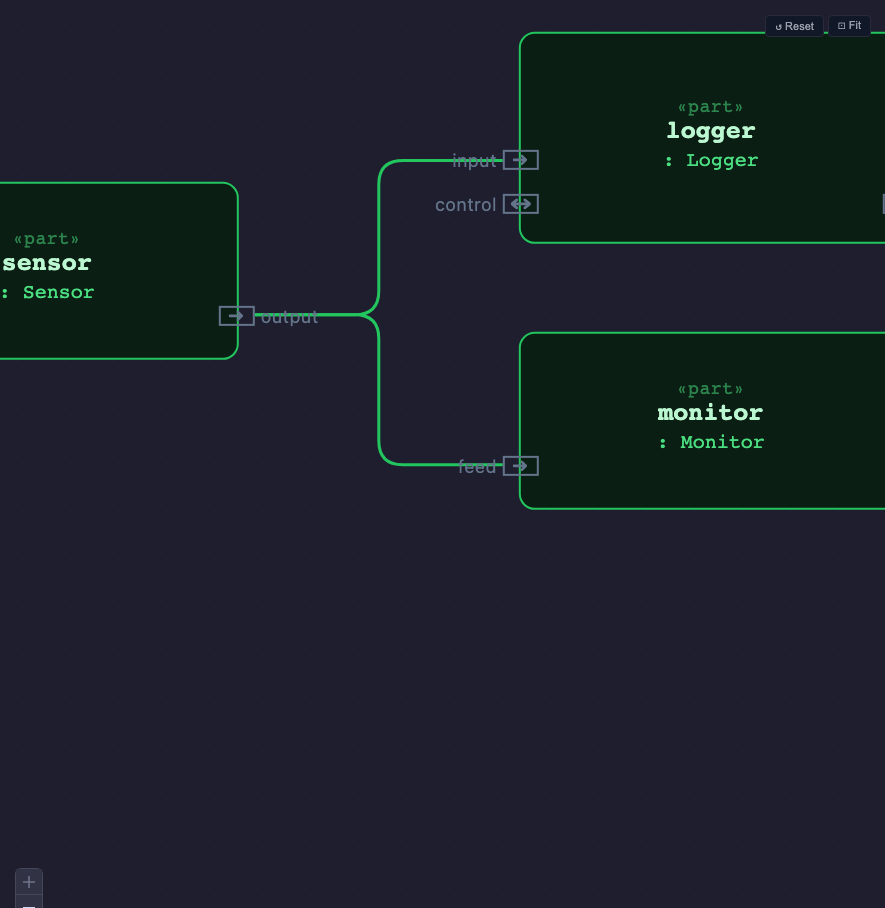

The port squares are positioned on the **left or right edge** of the part box
depending on their direction.  The label appears outside the box next to the
square.  Bidirectional ports (`↔`) can appear on either edge.

### Single part box

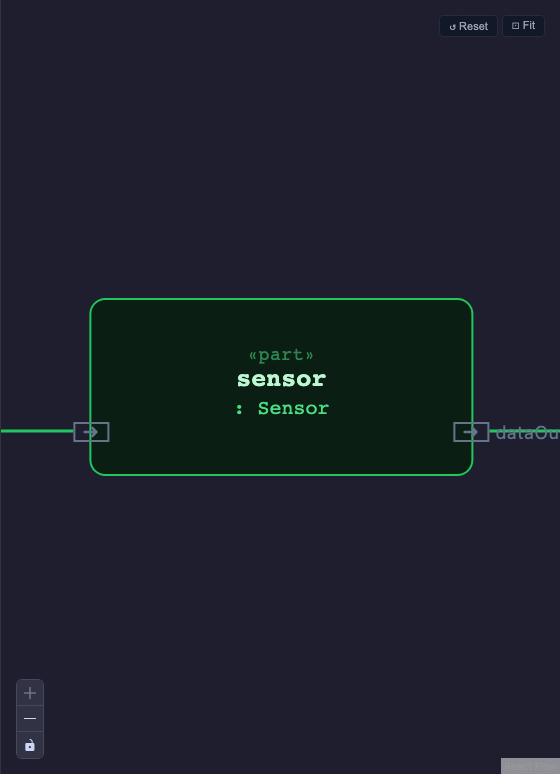

A part box shows:
- `«part»` stereotype in small text at the top
- Part usage name in bold
- `: TypeName` below the name
- Port squares on the left edge (in-ports) and right edge (out-ports)

### Code + diagram side by side

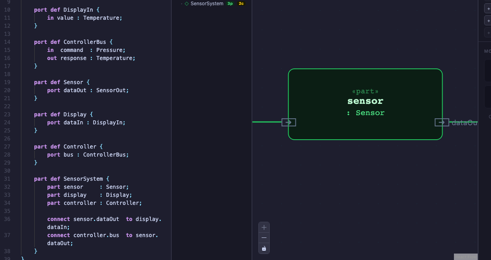

---

## Actions view

The Actions tab renders the execution flow of an `action def` as a directed
graph: step boxes, sequencing arrows, guarded branches, and fork/join bars.

### Diagram canvas

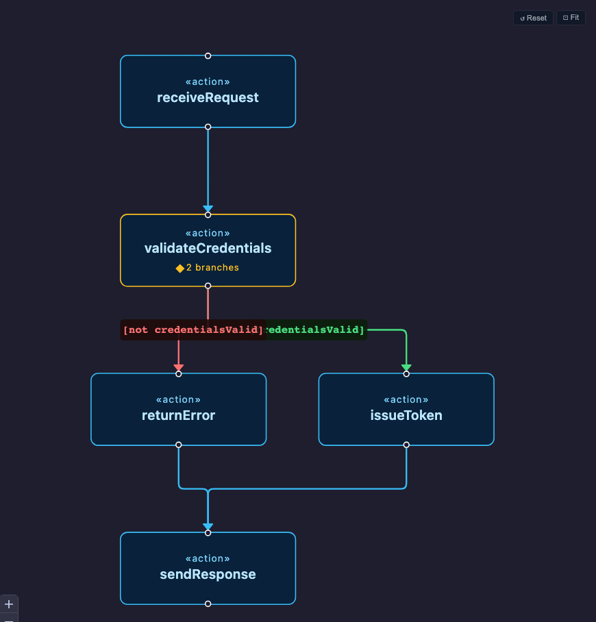

**Visual elements:**

| Element | Appearance |
|---|---|
| `action` step | Cyan-bordered rounded rectangle; `«action»` stereotype above the name |
| Initial node | Filled circle at the top of the first step |
| Terminal node | Hollow circle at the bottom of the last step |
| Unconditional flow (`first X then Y`) | Plain arrow between steps |
| Guarded flow (`first X if guard then Y`) | Coloured arrow with guard label in a pill badge; multiple guards on the same source node show a `◆ N branches` badge on that node |
| True branch | Green arrow |
| False branch (`not guard`) | Red arrow |
| `fork` node | Horizontal bar with one incoming and multiple outgoing arrows |
| `join` node | Horizontal bar with multiple incoming and one outgoing arrow |
| `decide` node | Diamond with one incoming and guarded outgoing arrows |
| `merge` node | Diamond with multiple incoming and one outgoing arrow |

---

## Sequence view

The Sequence tab renders a UML-style sequence diagram with vertical lifelines,
horizontal message arrows, execution activation bars, and `alt` combined
fragments for conditional branches.

### Diagram canvas

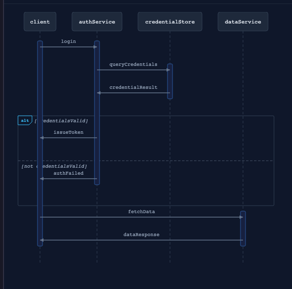

**Visual elements:**

| Element | Appearance |
|---|---|
| Lifeline | Header box at the top with the `part` usage name; dashed vertical line extending downward |
| Message arrow | Horizontal solid arrow from source to target lifeline, labelled with the message name |
| Execution bar | Filled vertical rectangle on the lifeline showing when that participant is active |
| `alt` combined fragment | Bordered box spanning the relevant lifelines; top-left corner shows `alt`; each branch is separated by a dashed horizontal divider; guard condition label in brackets at the top-left of each section |

Messages are drawn top-to-bottom in the order they appear in the source.
The `else` branch guard label is automatically inferred as the negation of the
`if` condition (e.g. `[credentialsValid]` → `[not credentialsValid]`).

---

## State view

The State tab renders a `state def` as a state machine diagram: state boxes,
an initial pseudo-state, and labelled transition arrows.

### How to open

The State view is not a tab in the normal tab bar.  To open it:

1. Parse the file containing the `state def`.
2. In the **Model Explorer**, locate the **STATE MACHINES** section.
3. Click the state machine name — the diagram area switches to the State view
   automatically.

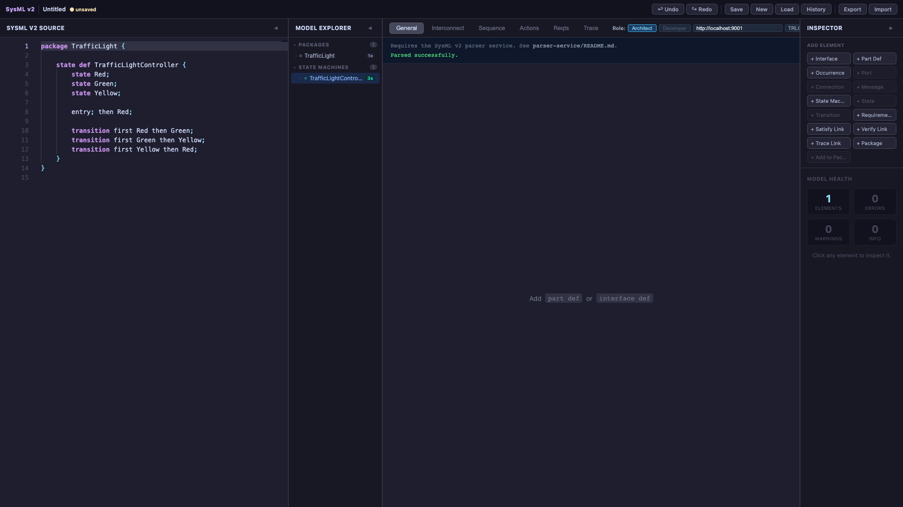

The screenshot above shows the state machine listed in MODEL EXPLORER under
STATE MACHINES.  The General tab is still active (canvas says "Add `part def`
or `interface def`") because the state machine name has not been clicked yet.

### Diagram canvas

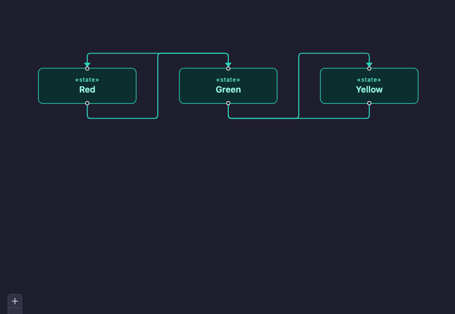

**Visual elements:**

| Element | Appearance |
|---|---|
| Initial pseudo-state | Filled teal circle with a downward arrow into the first state |
| `state` box | Teal-bordered rounded rectangle; `«state»` stereotype above the name |
| Forward transition | Straight downward arrow from the bottom of the source state to the top of the target; guard/trigger label on the arrow |
| Backward transition (loop-back) | Arrow routed to the left side of both states, exiting and entering on the left edge; keeps the diagram readable for cyclic machines |

The layout assigns each state a vertical level based on the succession graph
and places them top-to-bottom, routing backward edges to the left to avoid
crossing forward edges.
